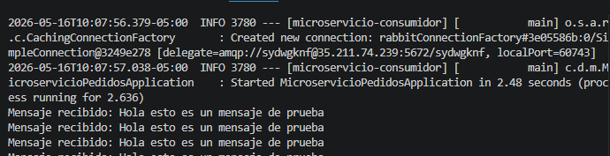
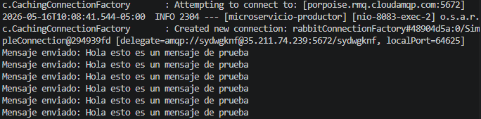
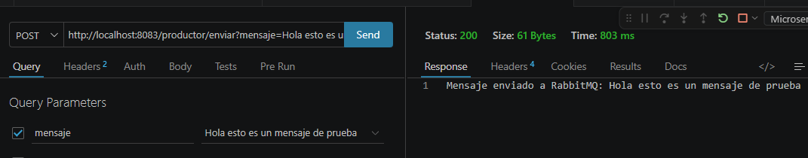
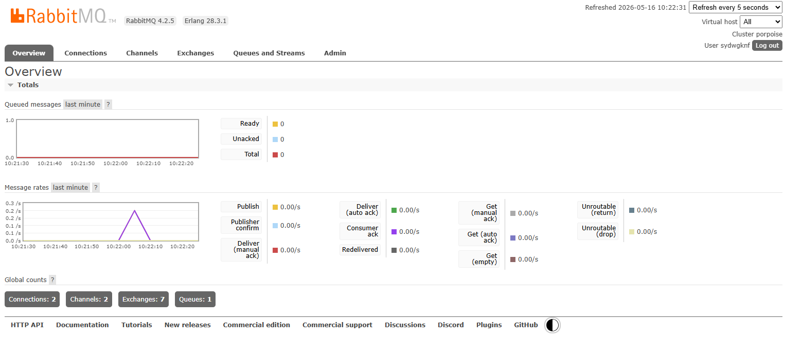

# Comunicación entre Microservicios — RabbitMQ
### Opción B — Comunicación Asíncrona | Spring Boot | Java 17 | Maven

---

## ¿Qué se hizo?

Se implementaron **1 microservicios Spring Boot** que se comunican de forma asíncrona mediante **RabbitMQ** alojado en CloudAMQP:

| Proyecto | Puerto | Rol |
|---|---|---|
| `microservicio-usuarios` (Productor) | 8083 | Envía mensajes a la cola de RabbitMQ |
| `microservicio-pedidos` (Consumidor) | 8084 | Escucha y procesa los mensajes de la cola |

---

## ¿Cómo funciona?

```
## Captura del sistema









```

El productor **no espera respuesta** — simplemente envía el mensaje a la cola y continúa. El consumidor lo procesa de forma independiente cuando lo recibe.

---

## ¿Por qué esto es comunicación asíncrona?

Porque el productor envía el mensaje a RabbitMQ y **continúa su ejecución sin esperar** que el consumidor lo procese. Si el consumidor estuviera caído, el mensaje quedaría guardado en la cola hasta que vuelva a levantarse.


---

## Estructura de archivos

```

## Cómo correr el proyecto

### Requisitos previos
- Java 17
- Maven
- Cuenta en CloudAMQP (ya configurada en application.properties)

### Paso 1 — Levantar el consumidor primero
```bash
cd microservicio-pedidos
mvn spring-boot:run
```

### Paso 2 — Levantar el productor
```bash
cd microservicio-usuarios
mvn spring-boot:run
```

> ⚠️ Es recomendable levantar primero el consumidor para que la cola ya esté creada cuando el productor envíe mensajes.

---

## Endpoint disponible

### microservicio-usuarios (Productor) — puerto 8083

#### Enviar mensaje a RabbitMQ
```
POST http://localhost:8083/productor/enviar?mensaje=Hola esto es un mensaje de prueba
```

Respuesta:
```
Mensaje enviado a RabbitMQ: Hola esto es un mensaje de prueba
```

Consola del **productor**:
```
Mensaje enviado: Hola esto es un mensaje de prueba
```

Consola del **consumidor**:
```
Mensaje recibido: Hola esto es un mensaje de prueba
```

---

## Configuración CloudAMQP

Ambos microservicios se conectan a RabbitMQ en la nube mediante CloudAMQP:

```properties
spring.rabbitmq.host=porpoise.rmq.cloudamqp.com
spring.rabbitmq.port=5672
spring.rabbitmq.username=sydwgknf
spring.rabbitmq.virtual-host=sydwgknf
```
